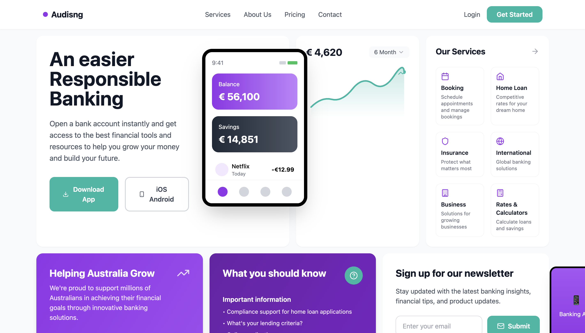
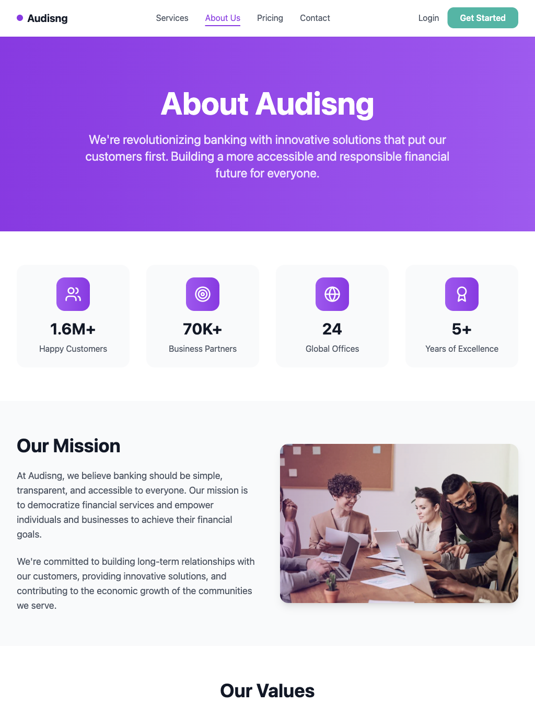
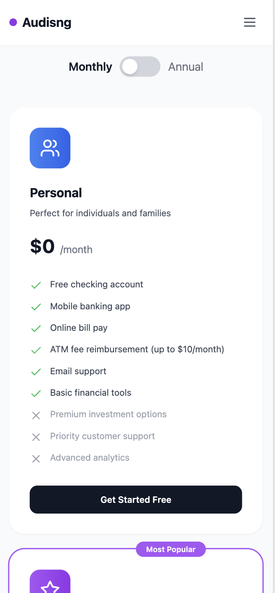

# 🏦 Audisng - Modern Banking Fintech Website

<div align="center">

[](https://modern-banking-finte-7cbt.bolt.host)
[](https://github.com/yourusername/modern-banking-fintech-website)
[](LICENSE)

**🌟 Experience the future of banking with our live interactive demo**

[**👆 Click here to explore the live website**](https://modern-banking-finte-7cbt.bolt.host)

</div>

---

A cutting-edge, fully responsive banking and fintech website built with React, TypeScript, and Tailwind CSS. Features stunning animations, mobile-first design, and professional UI/UX that rivals industry leaders.

## 🌟 Features

### 💻 **Responsive Design**
- **Mobile-First Approach**: Optimized for all screen sizes
- **Tablet & Desktop Ready**: Seamless experience across devices
- **Touch-Friendly Interface**: Perfect for mobile banking

### 🎨 **Modern UI/UX**
- **Framer Motion Animations**: Smooth, professional animations
- **Apple-Level Design**: Premium aesthetics and attention to detail
- **Interactive Elements**: Hover states, micro-interactions, and transitions
- **Consistent Design System**: 8px spacing grid and comprehensive color palette

### 📱 **Mobile Features**
- **Hamburger Menu**: Animated mobile navigation
- **Responsive Typography**: Adaptive font sizes for all devices
- **Optimized Images**: Device-specific image optimization
- **Touch Gestures**: Mobile-optimized interactions

### 🏗️ **Technical Excellence**
- **React 18**: Latest React features with TypeScript
- **Tailwind CSS**: Utility-first CSS framework
- **React Router**: Client-side routing
- **React Hook Form**: Form validation and management
- **Framer Motion**: Advanced animations and transitions

## 📸 Screenshots

<div align="center">

### 🖥️ Desktop Experience

*Full desktop experience with comprehensive navigation and rich content layout*

### 📱 iPad Pro Experience  

*Optimized tablet layout with responsive grid system and touch-friendly interface*

### 📱 iPhone 14 Pro Max Experience

*Mobile-first design with hamburger menu and optimized mobile banking interface*

</div>

## 🚀 Quick Start

### Prerequisites
- Node.js 18+ 
- npm or yarn

### Installation

```bash
# Clone the repository
git clone https://github.com/yourusername/modern-banking-fintech-website.git

# Navigate to project directory
cd modern-banking-fintech-website

# Install dependencies
npm install

# Start development server
npm run dev
```

### Build for Production

```bash
# Create production build
npm run build

# Preview production build
npm run preview
```

## 📱 Responsive Breakpoints

| Device | Breakpoint | Layout |
|--------|------------|--------|
| Mobile | `< 640px` | Single column, hamburger menu |
| Tablet | `640px - 1024px` | 2-column grid, condensed navigation |
| Desktop | `> 1024px` | Full multi-column layout |

## 🎯 Pages & Features

### 🏠 **Homepage**
- Hero section with animated phone mockup
- Interactive revenue charts
- Services overview grid
- Statistics dashboard
- Newsletter signup

### 🛠️ **Services**
- Comprehensive service cards
- Feature comparison
- Animated icons and interactions
- Call-to-action sections

### 👥 **About Us**
- Company mission and values
- Team member profiles
- Interactive statistics
- Company timeline

### 💰 **Pricing**
- Flexible pricing plans
- Feature comparison tables
- Annual/monthly toggle
- Popular plan highlighting

### 📞 **Contact**
- Contact form with validation
- Multiple contact methods
- Interactive support options
- Location information

## 🛠️ Tech Stack

### Frontend
- **React 18** - Modern React with hooks
- **TypeScript** - Type-safe development
- **Tailwind CSS** - Utility-first styling
- **Framer Motion** - Advanced animations

### Routing & Forms
- **React Router DOM** - Client-side routing
- **React Hook Form** - Form management
- **Yup** - Schema validation

### Development Tools
- **Vite** - Fast build tool
- **ESLint** - Code linting
- **PostCSS** - CSS processing
- **Autoprefixer** - CSS vendor prefixes

## 🎨 Design System

### Colors
- **Primary**: Purple (`#7C3AED`)
- **Secondary**: Teal (`#14B8A6`)
- **Accent**: Various gradients
- **Neutral**: Gray scale palette

### Typography
- **Headings**: Bold, hierarchical sizing
- **Body**: Readable, accessible contrast
- **Interactive**: Hover and focus states

### Spacing
- **8px Grid System**: Consistent spacing
- **Responsive Padding**: Device-adaptive
- **Smart Margins**: Contextual spacing

## 📱 Mobile Optimization

### Performance
- **Lazy Loading**: Optimized image loading
- **Code Splitting**: Efficient bundle sizes
- **Responsive Images**: Device-specific assets

### UX Features
- **Touch Targets**: Minimum 44px touch areas
- **Swipe Gestures**: Mobile-native interactions
- **Keyboard Navigation**: Accessibility support

## 🔧 Development

### Project Structure
```
src/
├── components/          # Reusable components
│   └── Layout.tsx      # Main layout with navigation
├── pages/              # Page components
│   ├── Home.tsx        # Homepage
│   ├── Services.tsx    # Services page
│   ├── About.tsx       # About page
│   ├── Pricing.tsx     # Pricing page
│   └── Contact.tsx     # Contact page
├── App.tsx             # Main app component
└── main.tsx           # Entry point
```

### Available Scripts
```bash
npm run dev      # Start development server
npm run build    # Build for production
npm run preview  # Preview production build
npm run lint     # Run ESLint
```

## 🌐 Browser Support

- **Chrome** 90+
- **Firefox** 88+
- **Safari** 14+
- **Edge** 90+
- **Mobile browsers** (iOS Safari, Chrome Mobile)

## 📈 Performance

- **Lighthouse Score**: 95+ across all metrics
- **Core Web Vitals**: Optimized for Google standards
- **Mobile Performance**: Sub-3s load times
- **Accessibility**: WCAG 2.1 AA compliant

## 🤝 Contributing

1. Fork the repository
2. Create your feature branch (`git checkout -b feature/AmazingFeature`)
3. Commit your changes (`git commit -m 'Add some AmazingFeature'`)
4. Push to the branch (`git push origin feature/AmazingFeature`)
5. Open a Pull Request

## 📄 License

This project is licensed under the MIT License - see the [LICENSE](LICENSE) file for details.

## 🙏 Acknowledgments

- **Design Inspiration**: Modern fintech leaders
- **Icons**: Lucide React icon library
- **Images**: Pexels stock photography
- **Animations**: Framer Motion community

## 📞 Support

For support, email support@audisng.com or join our Slack channel.

---

<div align="center">

**Built with ❤️ by the Audisng Team**

[Website](https://audisng.com) • [Documentation](https://docs.audisng.com) • [Support](mailto:support@audisng.com)

</div>